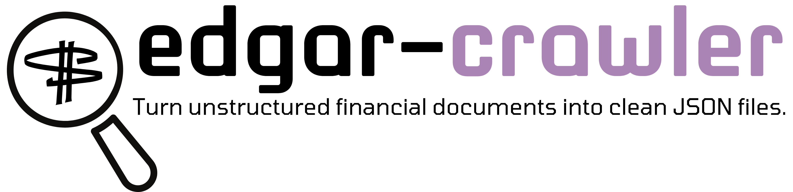

# EDGAR-CRAWLER: Unlock the Power of Financial Documents 🚀


Tired of sifting through endless financial reports of 100+ pages, struggling to extract meaningful insights? 

📊 `EDGAR-CRAWLER` is an open-source & optimized toolkit that retrieves key information from financial reports. It can crawl any report found in the [SEC EDGAR](https://www.sec.gov/edgar.shtml) database, the web repository for all publicly traded companies in the USA.

Most importantly, apart from downloading EDGAR filings like other standard toolkits, `EDGAR-CRAWLER` can also preprocess and convert them from lengthy and unstructured documents into clean and easy-to-use JSON files. 

### `EDGAR-CRAWLER` has 2 core modules:
📥🕷️ Business Documents Crawling: Utilize the power of the `edgar_crawler.py` module to effortlessly crawl and download financial reports for every publicly-traded company within your specified years.

🔍📑 Item Extraction: Extract and clean specific text sections such as Risk Factors or Management's Discussion & Analysis from 10-K documents (annual reports) and 8-K documents (current reports) using the `extract_items.py` module. Get straight to the heart of the information that matters most.

## Who Can Benefit from `EDGAR-CRAWLER`?
📚 Academics: Enhance your NLP research in economics & finance or business management by accessing and analyzing financial data efficiently.

💼 Professionals: Strengthen financial analysis, strategic planning, and decision-making with comprehensive, easy-to-interpret financial reports.

🛠 Developers: Seamlessly integrate financial data into your models, applications, and experiments using our open-source toolkit.

### Star History

[](https://star-history.com/#nlpaueb/edgar-crawler&Date)
## 🚨 News
- 2023-01-16: EDGAR-CORPUS, the biggest financial NLP corpus (generated from `EDGAR-CRAWLER`), is available as a HuggingFace 🤗 dataset card. See [Accompanying Resources](#Accompanying-Resources) for more details.
- 2022-10-13: Updated documentation and fixed a minor import bug.
- 2022-04-03: `EDGAR-CRAWLER` is available for Windows systems too.
- 2021-11-11: We presented EDGAR-CORPUS, our sister work that started it all, at [ECONLP 2021](https://lt3.ugent.be/econlp/) (EMNLP Workshop) at the Dominican Republic.

## Table of Contents
- [Install](#install)
- [Usage](#usage)
- [Citation](#citation)
- [Accompanying Resources](#accompanying-resources)
- [Contributing](#contributing)
- [License](#license)

## Install
- Before starting, it's recommended to create a new virtual environment using Python 3.8. We recommend [installing](https://docs.anaconda.com/anaconda/install/index.html) and [using Anaconda](https://conda.io/projects/conda/en/latest/user-guide/tasks/manage-environments.html#creating-an-environment-with-commands) for this.
- Install dependencies via `pip install -r requirements.txt`

## Usage
- Before running any script, you should edit the `config.json` file, which configures the behavior of our 2 modules. 
  - Arguments for `edgar_crawler.py`, the module to download financial reports:
      - `start_year XXXX`: the year range to start from (default is 2021).
      - `end_year YYYY`: the year range to end to (default is 2021).
      - `quarters`: the quarters that you want to download filings from (List).<br> Default value is: `[1, 2, 3, 4]`.
      - `filing_types`: list of filing types to download.<br> Default value is: `['10-K', '10-K405', '10-KT', '8-K']`.
      - `cik_tickers`: list or path of file containing CIKs or Tickers. e.g. `[789019, "1018724", "AAPL", "TWTR"]` <br>
        In case of file, provide each CIK or Ticker in a different line.  <br>
      If this argument is not provided, then the toolkit will download annual reports for all the U.S. publicly traded companies.
      - `user_agent`: the User-agent (name/email) that will be declared to SEC EDGAR.
      - `raw_filings_folder`: the name of the folder where downloaded filings will be stored.<br> Default value is `'RAW_FILINGS'`.
      - `indices_folder`: the name of the folder where EDGAR TSV files will be stored. These are used to locate the annual reports. Default value is `'INDICES'`.
      - `filings_metadata_file`: CSV filename to save metadata from the reports.
      - `skip_present_indices`: Whether to skip already downloaded EDGAR indices or download them nonetheless.<br> Default value is `True`.
  - Arguments for `extract_items.py`, the module to clean and extract textual data from already-downloaded reports:
    - `raw_filings_folder`: the name of the folder where the downloaded documents are stored.<br> Default value s `'RAW_FILINGS'`.
    - `extracted_filings_folder`: the name of the folder where extracted documents will be stored.<br> Default value is `'EXTRACTED_FILINGS'`.<br> For each downloaded report, a corresponding JSON file will be created containing the item sections as key-pair values.
    - `filings_metadata_file`: CSV filename to load reports metadata (Provide the same csv file as in `edgar_crawler.py`).
    - `filing_types`: list of filing types to extract.
    - `include_signature`: Whether to include the signature section after the last item or not.
    - `items_to_extract`: a list with the certain item sections to extract. <br>
      e.g. `['7','8']` to extract 'Management’s Discussion and Analysis' and 'Financial Statements' section items for 10-K reports.<br>
      By default this list is empty in which case all items are extracted.
    - `remove_tables`: Whether to remove tables containing mostly numerical (financial) data. This work is mostly to facilitate NLP research where, often, numerical tables are not useful.
    - `skip_extracted_filings`: Whether to skip already extracted filings or extract them nonetheless.<br> Default value is `True`.

- To download financial reports from EDGAR, run `python edgar_crawler.py`.
- To clean and extract specific item sections from already-downloaded documents, run `python extract_items.py`.
  - Reminder: We currently support the extraction of 10-K and 8-K documents. 

## Citation
An EDGAR-CRAWLER paper is on its way. Until then, please cite the relevant EDGAR-CORPUS paper published at the [3rd Economics and Natural Language Processing (ECONLP) workshop](https://lt3.ugent.be/econlp/) at EMNLP 2021 (Punta Cana, Dominican Republic):
```
@inproceedings{loukas-etal-2021-edgar,
    title = "{EDGAR}-{CORPUS}: Billions of Tokens Make The World Go Round",
    author = "Loukas, Lefteris  and
      Fergadiotis, Manos  and
      Androutsopoulos, Ion  and
      Malakasiotis, Prodromos",
    booktitle = "Proceedings of the Third Workshop on Economics and Natural Language Processing",
    month = nov,
    year = "2021",
    address = "Punta Cana, Dominican Republic",
    publisher = "Association for Computational Linguistics",
    url = "https://aclanthology.org/2021.econlp-1.2",
    pages = "13--18",
}
```
Read the paper here: [https://aclanthology.org/2021.econlp-1.2/](https://aclanthology.org/2021.econlp-1.2/)

## Accompanying Resources
- [EDGAR-CORPUS on Zenodo] EDGAR-CORPUS: The biggest corpus for financial NLP research, built from `EDGAR-CRAWLER` - [https://zenodo.org/record/5528490](https://zenodo.org/record/5528490)
- [EDGAR-CORPUS on HuggingFace 🤗 datasets] -[https://huggingface.co/datasets/eloukas/edgar-corpus/](https://huggingface.co/datasets/eloukas/edgar-corpus/)
- [Financial Word2Vec Embeddings] EDGAR-W2V: Word2vec Embeddings trained on EDGAR-CORPUS - [https://zenodo.org/record/5524358](https://zenodo.org/record/5524358)

## Contributing
PRs and contributions are accepted.
 
Please use the [Feature Branch Workflow](https://www.atlassian.com/git/tutorials/comparing-workflows/feature-branch-workflow).

## Issues
Please create an issue on GitHub instead of emailing us directly so all possible users can benefit from the troubleshooting.

## License
Please see the [GNU General Public License v3.0](https://github.com/nlpaueb/edgar-crawler/blob/main/LICENSE).
